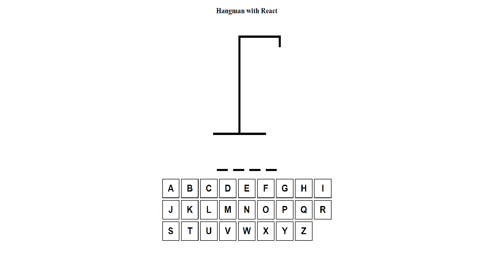
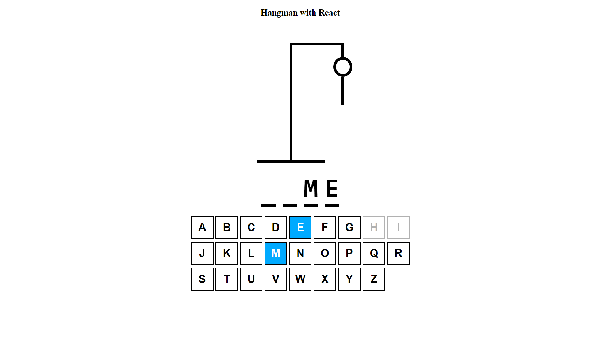
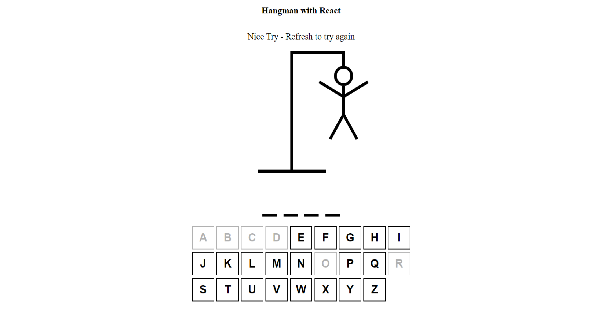
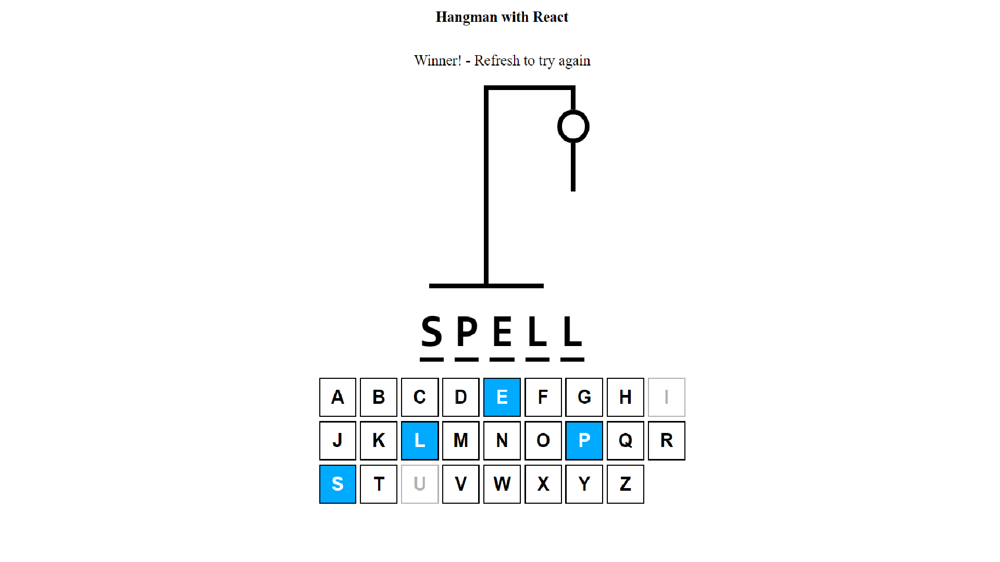

# Hangman Game

Ok, so this is my first -ever finished program- try with React. I only followed the instructor, but well, that is how we learn something, right?  
Thanks to [Web Dev Simplified](https://www.youtube.com/watch?v=-ONUyenGnWw) for this super crash course on React.  
Do not forget to visit their [GitHub](https://github.com/WebDevSimplified/react-hangman) too.

## Preview Game 
Here is the preview before the game starts. 

For the in-game  

And lastly, for the lost stage   

Also, the won stage   
